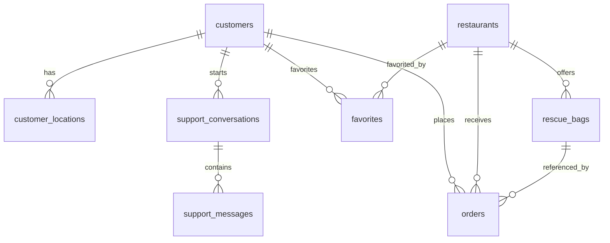

# 07 — Supabase database

This repo uses Supabase (hosted Postgres) as the primary backend.

The migrations in `supabase/migrations/` represent the “customer core schema” (customers, restaurants, rescue bags, orders, favorites) plus support chat.

## Entity relationships (core)

## Migrations (what each file does)

Location: `supabase/migrations/`

- `001_customer_schema.sql`
  - Creates tables: `customers`, `customer_locations`, `restaurants`, `rescue_bags`, `orders`, `favorites`
  - Creates indexes
  - Enables RLS and defines policies
  - Adds `updated_at` triggers
  - Adds helper function `calculate_distance(...)`
  - Inserts sample data (1 restaurant + 1 bag)
- `002_add_location_fields.sql`
  - Adds lat/lon fields (and indexes) for location-based filtering
  - Adds `address`/`city` fields on restaurants (note: `restaurants` already contains `address_line1` etc)
- `003_nearby_restaurants_function.sql`
  - Adds RPC `get_nearby_restaurants(user_lat, user_lon, radius_km)` as `SECURITY DEFINER`
  - Grants execution to `anon` and `authenticated`
- `004_fix_missing_customer_profiles.sql`
  - Inserts missing `customers` rows for existing auth users
- `005_support_chat_system.sql`
  - Creates `support_conversations` + `support_messages`
  - Enables RLS policies for customer and admin access
  - Adds tables to Supabase Realtime publication
- `006_dietary_options.sql`
  - Adds `dietary_info TEXT[]` to `rescue_bags`
- `007_razorpay_orders.sql`
  - Adds Razorpay IDs + pickup OTP + payment status columns to `orders`

## Tables (core behavior)

### `customers`

- One row per Supabase auth user (customer role).
- RLS: customers can read/update their own row.

### `restaurants`

- Contains restaurant metadata, location, and verification fields.
- RLS: “Anyone can view active verified restaurants” (customer apps can browse without service role).

### `rescue_bags`

- Daily inventory for each restaurant.
- RLS: “Anyone can view active rescue bags” (requires `quantity_available > 0`).

### `orders`

- Order status values in migration:
  - `pending`, `confirmed`, `ready`, `completed`, `cancelled`
- Payment columns added in later migration:
  - `razorpay_order_id`, `razorpay_payment_id`
  - `pickup_otp`
  - `payment_status`

### `favorites`

- A join table for customer → restaurant favorites.
- Unique constraint prevents duplicates.

## Support chat schema

### `support_conversations`

- Links:
  - `customer_id` (required)
  - `order_id` (optional)
  - `admin_id` (optional; set when an admin picks up the conversation)
- Status values: `open`, `in_progress`, `resolved`, `closed`

### `support_messages`

- Each message belongs to a conversation and has:
  - `sender_type`: `customer` / `admin`
  - `sender_id`: UUID (customer_id/admin_id)
  - `read_by_recipient`: boolean

Realtime is enabled on both support tables (see `005_support_chat_system.sql`).

## RLS strategy (how apps access data)

Customer web/mobile apps:

- Rely on RLS policies for reads/writes where possible.
- For operations that need elevated privileges (e.g. create customer profile at signup, create pay-at-pickup order, admin support), the app uses server routes with `SUPABASE_SERVICE_ROLE_KEY`.

Admin portals:

- Use `SUPABASE_SERVICE_ROLE_KEY` in server routes to bypass RLS and access all data.

## Known schema gaps / mismatches

Some tables referenced in app code are not defined in `supabase/migrations/`, including:

- `admins` (required for admin auth + permissions)
- onboarding tables referenced by onboarding flows (e.g. `Resturant Onboarding`, `onboarding`)

If you’re setting up a new Supabase project using only the migrations, you will need to create/port these ops tables as well.

